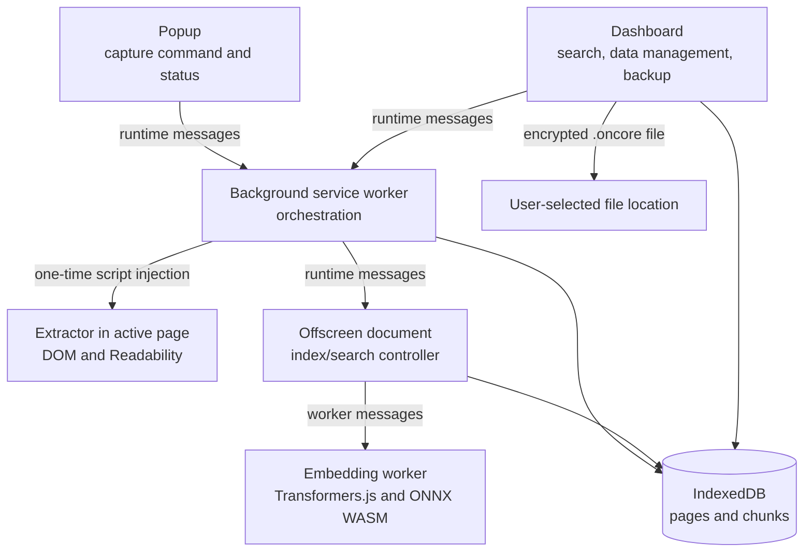
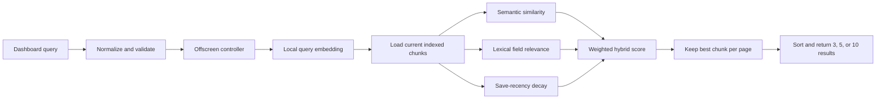
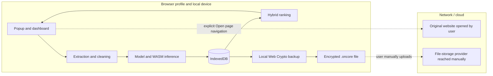

# On-Core Architecture

On-Core is a local-only Manifest V3 Chrome extension. Extension contexts are
separated so DOM access, durable storage, orchestration, and CPU/WASM inference
remain in the contexts suited to each responsibility.

## Extension Contexts



- **Popup:** starts an explicit capture and opens the dashboard.
- **Injected extractor:** accesses the selected page DOM, clones and sanitizes
  it, runs Mozilla Readability, and returns bounded text and metadata.
- **Background service worker:** validates capture messages, stores prepared
  pages/chunks, starts indexing, forwards searches, handles retry and deletion.
- **Offscreen document:** keeps indexing and search orchestration alive outside
  the event-driven service worker.
- **Embedding worker:** loads packaged model/WASM assets and performs CPU/WASM
  inference away from the UI thread.
- **Dashboard:** reads local state, starts searches, shows progress and grouped
  results, and provides deletion, privacy, encrypted export, and restore controls.
- **IndexedDB:** Dexie-managed durable storage for pages, chunks, embeddings,
  revisions, and indexing states.

## Capture And Indexing

```mermaid
flowchart LR
  U[Explicit Save Page] --> V{Active HTTP(S) tab?}
  V -->|No| E[Return safe error]
  V -->|Yes| I[Inject extractor]
  I --> R[Readability on cloned document]
  R --> F{Useful article text?}
  F -->|No| G[article, main, body fallbacks]
  F -->|Yes| C[Clean and bound text]
  G --> C
  C --> K[Unicode-safe overlapping chunks]
  K --> T[(Store page and pending chunks)]
  T --> Q[Claim pending batch]
  Q --> W[Mean-pooled normalized INT8 MiniLM inference]
  W --> M[Revision-checked commit]
  M --> S{More pending chunks?}
  S -->|Yes| Q
  S -->|No| Z[Page indexed or failed]
```

Duplicate canonicalized URLs update the existing page record, increment its
content revision, and replace old chunks. Embedding commits verify page and
chunk revisions so late worker results cannot overwrite newer content.

## Recovery States

Pages and chunks move through `pending`, `indexing`, `indexed`, and `failed`
states. At service-worker startup, interrupted `indexing` chunks and stale
embedding metadata are returned to `pending`. A failed page can be retried from
the dashboard. The current schema is Dexie version 4.

The stable database name, schema identifiers, message identifiers, model
identity, and local preference keys intentionally retain their historical names
to preserve existing browser-profile data.

## Search Pipeline



The default score is `0.65 * semantic + 0.25 * lexical + 0.10 * recency`.
Candidates below both the semantic and lexical thresholds are excluded.

## Local And Cloud Boundary



There is no application backend, remote model fetch, cloud inference,
telemetry, provider API, or synchronization path. Normal capture, indexing, and
search remain inside the extension. Opening an original result is a normal,
explicit browser navigation. Uploading an exported backup is a separate manual
user action outside the extension.

## Encrypted Portable Backup

The dashboard reads a transactionally consistent snapshot of the existing
schema-v4 `pages` and `chunks` stores. It converts typed embeddings to
little-endian Float32 bytes, validates all records, serializes a deterministic
versioned payload, and encrypts it with Web Crypto. PBKDF2-HMAC-SHA-256 uses
600,000 iterations and a random 32-byte salt to derive an AES-256-GCM key. Each
backup uses a fresh random 12-byte IV and authenticates the fixed-order public
envelope header as additional data.

Import rejects oversized, unsupported, malformed, unauthenticated, or invalid
payloads before any write. After the user reviews the authenticated summary and
confirms replacement, pages and chunks are cleared and bulk-written inside one
Dexie transaction. Operational content revisions are rebound and interrupted
`indexing` records return to `pending`, preventing pre-restore worker results
from committing into restored content. Transaction abort restores the previous
records. Restore is full replacement only; no merging or conflict resolution exists.

Passwords and keys are transient and are not persisted. Backup code does not
change the database schema, service-worker protocol, inference worker, CSP, or
permissions. The active IndexedDB stores remain plaintext.

## Local Privacy Lock

Before the dashboard content component mounts, an outer gate reads a versioned
salted verifier from `browser.storage.local` and an unlocked-session timestamp
from `browser.storage.session`. Popup rendering uses the same gate. Locked UI
does not mount database reads or render saved titles, snippets, counts, search
results, capture controls, or backup controls.

Setup and unlock derive a 32-byte verifier with PBKDF2-HMAC-SHA-256, 600,000
iterations, and a random 32-byte salt. Only the verifier, parameters, and
selected 5/15/30/60-minute timeout persist. The plaintext password and derived
bytes are not retained. Session storage is cleared by browser restart; explicit
lock and inactivity remove it earlier. This is interface access control only,
not IndexedDB encryption or a defense against browser-profile access.

## Why Linear Scan Is Acceptable

The MVP targets a bounded personal collection. It caps candidate processing at
20,000 indexed chunks and 512 chunks per page, then performs an exact scan that
is simple, deterministic, testable, and avoids another index format or runtime
dependency. This tradeoff is not suitable for very large corpora; a local
approximate-nearest-neighbor index is potential future work after measured need.

## Security Boundary

The manifest requests `activeTab`, `scripting`, `offscreen`, and `storage`, with no host
permissions. CSP allows extension-owned scripts, workers, connections, and
WASM execution while blocking objects and external bases. This limits remote
executable resources but does not encrypt IndexedDB or protect a compromised
browser profile, browser, operating system, or device.
