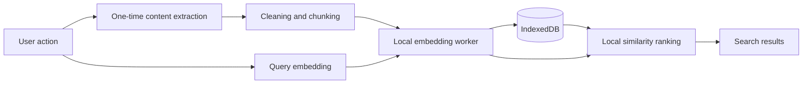

# Local Web Memory

Local Web Memory is a privacy-first Chrome extension that saves pages you
explicitly choose, embeds them on-device, and searches them semantically without
a backend.

## Problem and solution

Useful web pages are easy to lose and hard to rediscover with exact keywords.
This extension captures visible body text after an explicit click, stores it in
this browser profile, and uses local embeddings to retrieve related pages using
different wording.

## Key features

- Explicit page capture, cleaning, chunking, and duplicate URL updates
- Packaged offline local embeddings and semantic search
- IndexedDB storage with per-page retry, delete, and Delete All controls
- No accounts, telemetry, analytics, cloud inference, sync, or automatic capture

## Privacy and on-device AI

Title, canonical URL, visible body text, chunks, embeddings, indexing state,
and queries stay inside the extension's IndexedDB and local worker. The bundled
model is `Xenova/all-MiniLM-L6-v2`, revision
`751bff37182d3f1213fa05d7196b954e230abad9`, INT8, 384 dimensions, embedding
version 1. Transformers.js and ONNX Runtime Web run CPU/WASM inference locally.
No model download or external inference request is required. Clicking **Open
original** intentionally navigates to that website.

Requested permissions are `activeTab` for the explicit save action,
`scripting` for one-time extraction, and `offscreen` for local inference. Host
permissions are empty.

## Architecture



## Setup and build

Requires Node.js and pnpm.

```sh
pnpm install
pnpm lint
pnpm typecheck
pnpm test
pnpm build
```

Load `.output/chrome-mv3` through `chrome://extensions` with Developer mode
enabled, then choose **Load unpacked**.

## Usage

1. Open an HTTP(S) page and click **Save Page** in the popup.
2. Wait for local indexing in the dashboard.
3. Search using natural language and open a ranked result if desired.
4. Retry failed pages, delete one page, or delete all local data from the
   Privacy & Local Storage panel.

## Screenshots and demo

Screenshot placeholders: `docs/assets/screenshots/README.md`.
Demo outline: `docs/DEMO.md`.

## Limitations and future scope

Capture uses visible body text rather than Mozilla Readability. Search is an
exact bounded linear scan. Restricted browser pages cannot be captured. Mobile,
PWA support, accounts, sync, encryption, and automatic capture are not
implemented.

## Attribution and license

See `THIRD_PARTY_NOTICES.md`. Project source is MIT licensed; bundled model and
runtime components retain their own licenses.
