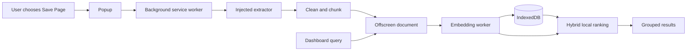

# On-Core

**Private, on-device search for the web you choose to remember.**

On-Core is a Chrome extension built for **OSDHack 2026**. It captures only the
pages a user explicitly saves, extracts their readable text, creates local
embeddings, and retrieves them with hybrid semantic, lexical, and recency
ranking. It has no backend, account, telemetry, or cloud inference.

## Project Status

Submission candidate, version `0.1.0`. The local capture, extraction, indexing,
search, deletion, theme, and privacy flows are implemented and covered by the
repository test suite. Manual Chromium checks and final submission media remain
listed in the checklist below.

**Demo video:** Not yet added. Replace this line with the final public demo URL
before submission.

## Screenshots

No screenshots are committed yet, so this README does not link to fabricated or
missing images. Before submission, capture and add:

- Dashboard overview
- Search results for a paraphrased query
- Local indexing progress

Place final images under `assets/screenshots/`, then add their real paths here.

## Problem

Bookmarks preserve links but are difficult to rediscover when the user
remembers an idea rather than an exact title. Sending browsing data to a hosted
AI search service introduces another privacy and availability dependency.

## Solution

On-Core turns explicitly selected pages into a private, searchable memory in
the current browser profile. Mozilla Readability and bounded fallbacks extract
text. A packaged MiniLM model embeds page chunks and queries on the device.
Search combines semantic similarity, lexical relevance, and save recency, then
groups matching chunks into one result per page.

## Implemented Features

- Explicit **Save Page** capture for the active HTTP(S) tab
- Mozilla Readability extraction with `article`, `main`, and sanitized body
  fallbacks
- Bounded text cleaning, Unicode-safe chunking, and duplicate-URL updates
- Packaged INT8 MiniLM embeddings generated in a dedicated worker
- IndexedDB persistence with indexing states, startup recovery, and per-page
  retry
- Hybrid semantic, lexical, and recency ranking with one result per page
- Result-count choices of 3, 5, and 10, with 3 as the default
- Per-page deletion and isolated **Delete all** controls
- Persistent light, dark, and system themes
- Responsive Material 3 Expressive-inspired pastel interface
- No automatic browsing-history capture, accounts, backend, or analytics

## On-Device AI Verification

The following operations run locally inside extension contexts:

- Page extraction
- Text cleaning
- Chunking
- Stored-page embedding generation
- Query embedding generation
- Semantic similarity
- Lexical ranking
- Recency ranking
- IndexedDB persistence

There is no cloud inference and no telemetry. On-Core sends no user data during
normal capture, indexing, or search operation. Model and runtime assets are
packaged in the extension, so internet access is not required for core search
after installation. Opening a saved result intentionally navigates to its
original website.

Remote model loading and runtime caches are disabled in
`lib/embedding-runtime.ts`. The manifest has no host permissions and its CSP
limits connections and executable resources to the extension itself.

## Architecture



See [ARCHITECTURE.md](ARCHITECTURE.md) for context and pipeline diagrams.

## Technology Stack

- WXT and Manifest V3
- React 19 and TypeScript
- Dexie over IndexedDB
- Mozilla Readability
- Transformers.js
- ONNX Runtime Web using CPU/WASM
- Vitest and ESLint

## Model

| Property | Value |
| --- | --- |
| Runtime identifier | `Xenova/all-MiniLM-L6-v2` |
| Pinned revision | `751bff37182d3f1213fa05d7196b954e230abad9` |
| Original model identity | `sentence-transformers/all-MiniLM-L6-v2` |
| Quantization | INT8 (`model_int8.onnx`) |
| Embedding dimension | 384 |
| Pooling | Mean pooling |
| Normalization | Unit-length normalization |
| Execution | ONNX Runtime Web, CPU/WASM, one worker thread |

The pinned revision is recorded in source and used by the local pipeline. The
bundled files do not include an independent provenance manifest that binds
their checksum to the upstream revision.

## Requirements

- Desktop Chrome or Chromium with Manifest V3 and offscreen-document support
- Node.js `20.19.0` or newer
- pnpm `11.1.3` (declared by `packageManager`)

## Setup

```sh
git clone <repository-url>
cd on-core
pnpm install
```

## Build And Verify

Every command below exists in `package.json`:

```sh
pnpm lint
pnpm typecheck
pnpm test
pnpm build
```

For development mode:

```sh
pnpm dev
```

## Install In Chrome

1. Run `pnpm build`.
2. Open `chrome://extensions`.
3. Enable **Developer mode**.
4. Select **Load unpacked**.
5. Choose `.output/chrome-mv3` from this repository.
6. Pin On-Core from the extensions menu if desired.

## Usage

1. Open a normal HTTP(S) article or page.
2. Open the On-Core popup and select **Save Page**.
3. Open the dashboard and wait for local indexing to finish.
4. Search with an idea, exact phrase, hostname, or related wording.
5. Open a result, retry a failed index, or delete saved data as needed.

Example: after saving a page that explains offline semantic retrieval, search
for `find pages about private local retrieval`. Once indexing is complete, the
expected output is the relevant saved page, shown once with its strongest
matching chunk as the snippet. Results depend only on pages the user saved.

## Privacy And Permissions

On-Core stores extracted page content, metadata, chunks, embeddings, and
indexing state in extension IndexedDB. Queries are processed transiently and
are not persisted by On-Core. Theme and result-count preferences use extension
page local storage.

| Permission | Reason |
| --- | --- |
| `activeTab` | Access only the tab involved in an explicit save action |
| `scripting` | Inject the one-time page extractor after that action |
| `offscreen` | Host local model inference outside the service worker |

`host_permissions` is empty. See [PRIVACY.md](PRIVACY.md) for deletion,
limitations, and the threat model.

## Performance And Evaluation

Verified package footprints, the ranking formula, and the automated test count
are documented in [TECHNICAL_REPORT.md](TECHNICAL_REPORT.md). No reliable
latency, memory, or retrieval-accuracy metric has been recorded, so none is
claimed.

Evaluation uses deterministic unit tests for extraction fallbacks, cleaning,
chunk boundaries, persistence, indexing recovery, worker messages, ranking,
preferences, deletion-related database behavior, and UI structure. Final
evaluation must also exercise the unpacked extension in Chromium, including an
offline search after the model has initialized.

## Known Limitations

- Restricted browser pages and pages that block extension injection cannot be
  captured.
- Readability and fallback extraction may omit content on highly dynamic pages.
- Search performs a bounded exact linear scan over local indexed chunks; it is
  intended for an MVP-sized personal collection, not a very large corpus.
- Local model initialization and indexing can be CPU-intensive on slower
  devices.
- Saved content and embeddings are not encrypted at rest by On-Core; browser
  profile and device security remain important.
- No mobile application, PWA, automatic capture, import/export, or account
  system is implemented.

## Future Scope

Potential future work includes larger-corpus indexing, more robust database
repair, accessibility testing across additional browsers, and user-controlled
cloud backup with encrypted synchronization. Cloud backup and encrypted sync
are future work only; they are not implemented or represented in the current
architecture.

## Demo Outline (2-3 Minutes)

1. State the bookmark rediscovery and privacy problem.
2. Introduce On-Core as private, on-device search.
3. Save a page from the popup.
4. Show local indexing progress in the dashboard.
5. Search using wording different from the page title.
6. Show the correct grouped result and matching snippet.
7. Disconnect the network and run the search again.
8. Show the privacy panel, local model details, permissions, and empty host
   permissions.
9. Mention current limitations and future scope.

## Attribution

Third-party components and verified licenses are listed in
[ATTRIBUTION.md](ATTRIBUTION.md). The source model's Apache 2.0 text is retained
at `public/models/Xenova/all-MiniLM-L6-v2/LICENSE`.

## License

On-Core source is available under the [MIT License](LICENSE). Third-party
components remain under their respective licenses.

## Final Submission Checklist

- [x] Public product branding is On-Core.
- [x] Local feature set is documented without cloud or encryption claims.
- [x] Lint, typecheck, tests, and production build pass.
- [x] Generated manifest and packaged local assets are audited.
- [ ] Add the final demo video URL to this README.
- [ ] Capture and add a dashboard screenshot.
- [ ] Capture and add a search-results screenshot.
- [ ] Capture and add an indexing-progress screenshot.
- [ ] Complete manual Chromium checks listed in the completion report.
- [ ] Submit the final repository and media through Unstop.
